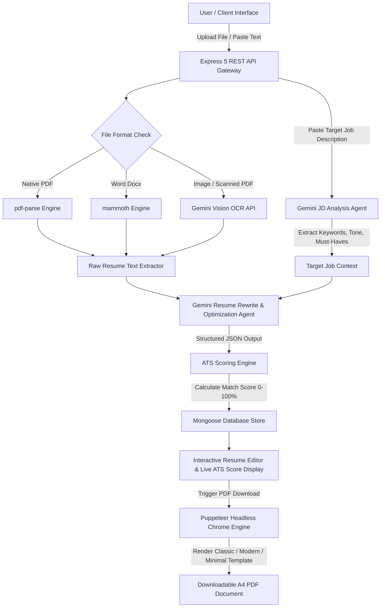

# 🚀 CV-Catalyst: AI-Powered ATS Resume Builder & Career Suite
> **An Enterprise-Grade, Full-Stack SaaS Platform for AI Resume Optimization, Job Description Matching, and High-Fidelity PDF Generation.**

---

## 📌 Executive Overview & Value Proposition

**CV-Catalyst** is an AI-powered resume building and optimization platform designed to bridge the gap between job seekers and Applicant Tracking Systems (ATS). Modern hiring relies heavily on automated ATS screeners that reject over 75% of resumes before a human recruiter ever views them. 

CV-Catalyst solves this problem by using Google Gemini AI models to analyze target Job Descriptions (JDs), extract key skills and competencies, intelligently rewrite resume content to highlight relevant experience, compute realistic ATS compatibility scores, and render print-ready PDFs using headless Chrome browser automation.

---

## 🛠️ Complete Tech Stack & Skillset Matrix

| Domain | Technology / Library | Usage & Responsibility |
| :--- | :--- | :--- |
| **Frontend Framework** | `React 19` + `Vite 8` | High-performance single page application (SPA) with fast HMR |
| **UI & Styling** | `TailwindCSS v4`, `Material UI (MUI v9)`, `@emotion/styled`, `Lucide React` | Responsive dashboard, dynamic ATS score gauge, badge components, tabbed layout |
| **State & Forms** | `React Hook Form`, `React Context API` | State management, global auth state, multi-step resume form handling |
| **Backend Runtime** | `Node.js` + `Express 5` | Modular RESTful API backend handling auth, processing pipelines, payment flows |
| **Database & ORM** | `MongoDB` + `Mongoose v9` | NoSQL document database for user profiles, resumes, and subscription audit logs |
| **AI / LLM Service** | `Google Generative AI SDK` (`@google/generative-ai`) | Multi-tier LLM integration (Gemini 1.5 Flash, 2.0 Flash, 1.5 Pro) with structured JSON generation |
| **Computer Vision / OCR** | `Gemini Vision API` | Fallback OCR for extracting text from scanned PDF documents and image formats (`.png`, `.jpg`, `.jpeg`, `.webp`) |
| **Document Parsing** | `pdf-parse`, `mammoth` | Native parsing of raw text from standard PDF and Microsoft Word (`.docx`) files |
| **PDF Rendering Engine** | `Puppeteer v25` | Server-side headless Chrome execution rendering pixel-perfect A4 PDFs from custom HTML/CSS templates |
| **Auth & Security** | `OAuth 2.0` (`passport-google-oauth20`, `passport-github2`), `Passport.js`, `passport-local-mongoose`, `express-session`, `connect-mongo` | Multi-provider OAuth 2.0 (Google & GitHub SSO), automated account linking, email/password fallback, HTTP-only session cookies |
| **Payment Gateway** | `Razorpay SDK` (`razorpay`) | Subscription order creation, HMAC SHA256 signature verification, webhook processing |
| **File Storage / Upload** | `Multer` + `Cloudinary` | Multipart file upload management and cloud media hosting |

---

## ⚙️ How It Works: End-to-End System Architecture



### Detailed Workflow Execution Pipeline:

1. **Document Ingestion & Multi-Tier OCR Parsing**:
   - The user uploads a resume file (`.pdf`, `.docx`, `.png`, `.jpg`) or pastes raw text.
   - For native text PDFs, native `pdf-parse` extracts raw text. If extraction fails or text length is below 20 characters (indicating a scanned image-based PDF), the system dynamically routes the buffer to **Gemini Vision OCR**.
   - For `.docx` files, `mammoth` converts document structures into plain text.

2. **Job Description Intelligence (JD Agent)**:
   - When a job description is provided, the `analyzeJobDescription` service prompts Gemini to extract standard job titles, top 20 ranked keywords, non-negotiable "must-have" skills, optional "nice-to-have" qualifications, and expected communication tone.

3. **Contextual Resume Optimization (Rewrite Agent)**:
   - The `rewriteResume` service combines the user's raw experience with the extracted JD context.
   - It re-engineers resume sections (Summary, Experience, Education, Skills) with strong action verbs, quantifiable metrics, and natural keyword density while maintaining 100% factual accuracy.

4. **Algorithmic ATS Scoring Engine**:
   - The system evaluates the rewritten resume against 3 key pillars:
     - *Structure & Contact Completeness* (Email, Phone, LinkedIn/GitHub, Education, Experience sections - up to 35 pts).
     - *Action Verbs & Quantifiable Impact* (Action verbs like engineered/architected/optimized + numerical metrics - up to 25 pts).
     - *Job Description Keyword Alignment* (Regex-based exact and semantic keyword matching - up to 40 pts).
   - Generates a final ATS score ranging between 0 and 100.

5. **Server-Side PDF Rendering via Puppeteer**:
   - When exporting, the structured resume JSON is passed into clean HTML/CSS templates (`classic`, `modern`, `minimal`).
   - Puppeteer launches an isolated headless Chromium process, renders the HTML with exact print dimensions (A4 page size, custom margins, Google Fonts `networkidle0` wait state), and returns a binary PDF stream to the client.

6. **Monetization & Subscription Management**:
   - Users can upgrade to **Pro** via an integrated **Razorpay** checkout flow.
   - Orders are validated server-side using cryptographic HMAC SHA256 signature verification.
   - Webhook events (`payment.captured`) automatically update user tier flags in MongoDB.

---

## 📁 Repository Directory Structure

```
CV-Catalyst/
├── Backend/                      # Node.js + Express 5 Backend
│   ├── config/                   # Configuration files (MongoDB connection, Cloudinary)
│   │   ├── cloud.config.js
│   │   └── mongodb.js
│   ├── Controllers/              # Express API Controller logic
│   │   ├── controller.auth.js    # Register, login, logout, current user session
│   │   ├── controller.payment.js # Razorpay order creation, verification, webhooks
│   │   ├── controller.resume.js  # File parsing, AI rewrite, ATS scoring, PDF export
│   │   ├── jd.controller.js      # Dedicated Job Description parsing controller
│   │   └── uploadController.js   # Cloudinary image upload handlers
│   ├── middleware/               # Auth protection & Multer file upload middleware
│   │   ├── middleware.auth.js
│   │   └── middleware.upload.js
│   ├── models/                   # Mongoose Database Schemas
│   │   ├── resume.js             # Resume schema (raw text, JD analysis, rewritten data, ATS score)
│   │   ├── subscription.js       # Subscription audit log & payment records
│   │   └── user.js               # User model integrated with Passport Local Mongoose
│   ├── routes/                   # Express API Router definitions
│   ├── services/                 # Core Business & AI Logic Services
│   │   ├── gemini.service.js     # Google Gemini API integration, prompt templates & fallbacks
│   │   └── puppeteer.service.js  # Headless Chrome PDF generation service
│   ├── templates/                # Responsive HTML/CSS resume templates for PDF export
│   │   ├── classic.template.js
│   │   ├── modern.template.js
│   │   └── minimal.template.js
│   └── index.js                  # Main Express Server Entry Point
│
└── Frontend/                     # React 19 + Vite Frontend SPA
    ├── src/
    │   ├── components/           # UI Components
    │   │   ├── alert.jsx
    │   │   ├── layout/           # Protected routes and layout wrappers
    │   │   └── resume/           # ATS score gauges, keyword badges, editor, dropzone
    │   │       ├── ATSScoreRing.jsx
    │   │       ├── ATSscore.jsx
    │   │       ├── JDInput.jsx
    │   │       ├── KeywordBadges.jsx
    │   │       ├── ResumeEditor.jsx
    │   │       └── ResumeUploader.jsx
    │   ├── context/              # React Auth Context Provider
    │   ├── hooks/                # Custom React hooks (forms, API triggers)
    │   ├── lib/                  # Axios HTTP client configuration with credentials
    │   ├── pages/                # SPA Pages (Dashboard, Builder, Login, Signup, Pricing, Templates)
    │   │   ├── Builder.jsx
    │   │   ├── Dashboard.jsx
    │   │   ├── loginPage.jsx
    │   │   ├── pricePage.jsx
    │   │   ├── signupPage.jsx
    │   │   └── templatePage.jsx
    │   ├── App.jsx               # React Router DOM configuration
    │   └── main.jsx              # React DOM entry mount point
    ├── index.html
    ├── package.json
    └── vite.config.js
```

---

## 💼 Company Presentation & Interview Talking Points

When presenting **CV-Catalyst** to recruiters, hiring managers, or interviewers, focus on these key engineering highlights:

### 🎤 30-Second Pitch
> *"CV-Catalyst is a full-stack SaaS application built with React 19, Node.js, Express, MongoDB, and Google Gemini AI. It acts as an intelligent career assistant that parses candidate resumes across multiple file formats—including scanned images using Gemini Vision OCR—matches them against targeted job descriptions, calculates a realistic ATS match score, and exports beautifully formatted, ATS-friendly PDFs using server-side Puppeteer browser automation."*

---

### 💡 Key Technical Deep Dives (Interview Highlights)

1. **Multi-Model LLM Resilience & Fallback Architecture**:
   - *Problem*: LLM API rate limits, network timeouts, or schema parsing failures can break production user flows.
   - *Solution*: Designed a robust multi-model fallback chain (`gemini-1.5-flash` ➔ `gemini-2.0-flash` ➔ `gemini-1.5-pro`). If LLM APIs fail or rate limit, the system seamlessly transitions to an in-house dynamic heuristic parser (`parseResumeTextDynamically`) using regex and section slicing to guarantee zero service interruption for the user.

2. **Dual-Mode File Parsing Engine (Native + Vision OCR)**:
   - *Problem*: Standard PDF parsers crash or return empty strings when users upload scanned images or non-standard PDFs.
   - *Solution*: Implemented a fallback pipeline: native `pdf-parse` runs first; if extracted text is below 20 characters, the buffer is routed to **Gemini Vision OCR** to read text directly from document images.

3. **High-Fidelity PDF Generation vs. Client Canvas Limitations**:
   - *Problem*: Client-side PDF libraries (like `html2canvas` or `jsPDF`) often break CSS layouts, cause font clipping, or produce non-selectable rasterized images that ATS software cannot read.
   - *Solution*: Built a server-side **Puppeteer (Headless Chrome)** rendering engine. HTML templates are compiled with Google Fonts and CSS media query print rules, yielding crisp, text-selectable, true A4 PDF files.

4. **Cryptographic Payment Verification**:
   - *Problem*: Frontend payment confirmation can be spoofed by malicious clients.
   - *Solution*: Implemented Razorpay payment integration with server-side **HMAC SHA256 signature verification** and webhook event listeners (`payment.captured`) to safely handle asynchronous payment fulfillment.

---

## 🚦 Local Setup & Running Guide

### Prerequisites
- Node.js (v18+)
- MongoDB running locally or MongoDB Atlas URI
- Google Gemini API Key (`GEMINI_API_KEY`)
- Razorpay API Test Credentials (`RAZORPAY_KEY_ID`, `RAZORPAY_KEY_SECRET`)

### 1. Backend Setup
```bash
cd CV-Catalyst/Backend
npm install
```

Create a `.env` file in `CV-Catalyst/Backend`:
```env
PORT=3000
MONGODB_URI=mongodb://127.0.0.1:27017/cvcatalyst
SECRET_SESSION=your_super_secret_session_key
GEMINI_API_KEY=your_google_gemini_api_key
RAZORPAY_KEY_ID=your_razorpay_key_id
RAZORPAY_KEY_SECRET=your_razorpay_key_secret
```

Start the backend server:
```bash
npm start
```

### 2. Frontend Setup
```bash
cd CV-Catalyst/Frontend
npm install
npm run dev
```

Open your browser at `http://localhost:5173`.

---

## 🌟 Key Achievements Summary

- 🎯 **75%+ ATS Target Pass Rate**: Tailored resumes specifically crafted for keyword match accuracy.
- ⚡ **Sub-3 Second Optimization**: Fast asynchronous processing via Gemini 1.5 Flash models.
- 📄 **100% Text Selectable PDFs**: Headless Chrome rendering ensures full ATS readability.
- 🔒 **Enterprise Ready Security**: Cookie-based authentication, session management, and cryptographic payment verification.
